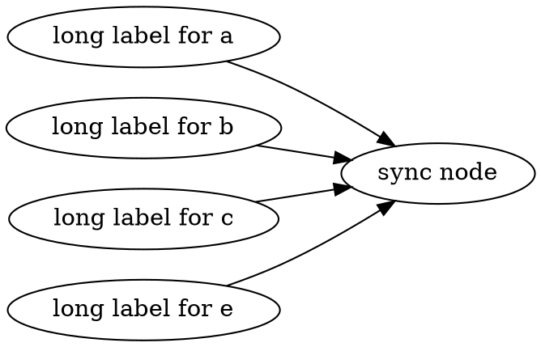

# API

## Use the layout engine directly

When you interact with a renderer, many details are hidden under the hood.
Here, to show how to call the engine directly

### Create a geometry graph and call the default layout

We need to say a few words on the classes involved.
Let us describe the design of Node, Graph, and Edge.

Edge is the simplest of these three: it has the source and the target that are Nodes.
Node has three sets of Edges: outEdges, inEdges, and selfEdges.
If you have an object of Node available you can iterate over all edges adjacent to it.
For example, to process all edges having node 'n' as the source do the following:

```ts
for (const e of n.outEdges()) {
  // process edge 'e'
}
```

Graph extends Node, but in addition it has a NodeCollection, which is a wrapper
of Map<string, Node>: this way a Graph can reference its nodes. To create a sub-graph we just
add a Graph as a new node to the graph.

```ts
const graph = new Graph()
const subgraph = new Graph('a')
graph.addNode(subgraph)
```

This design seems minimal and efficient enough to maintain the graph structure. For example, to iterate over all edges of the graph
we go over the nodes in the graph's NodeCollection and iterate over outgoing and self-edge of the nodes.

The classes Graph, Node, and Edge extend class Entity. Entity has a field parent that is also an Entity.
This way a Node, and an Edge, have a reference to the Graph they belongs to.
There is a class Label to facilitate labelled edges. The parent of a Label is the labeled edge.

Entity has an array of Attributes. The Attributes keep additional information associated with the graph entities.
There are geometry attributes, drawing attributes, and some others.
The geometry attributes are needed to create a layout. The drawing attributes are used during rendering.
The attributes are a convenient mechanism to avoid a duplication of the graph structure.

Now we can return to the engine level layout example.

```ts
//First we create a Graph, the underlying structure to keep your graph.
const graph = new Graph()
// add some nodes and edges to the graph.
// add a node with id 'b'
const b = new Node('b')
graph.addNode(b)
// add a node with id 'c'
const c = new Node('c')
graph.addNode(c)
// create edges b->c, and d->a
const bc = new Edge(b, c)
new Edge(b, c)
```

The last statement of the code above

```ts
new Edge(b, c)
```

creates an instance of class Edge and adds it to b.outEdges and c.inEdges.
This way the edge the edge is attached to the graph.
For the engine to run the layout, the nodes geometry is needed. For this examples we create circular nodes.

```ts
// create a geometry node gb
const gb = new GeomNode(b)
gb.boundaryCurve = CurveFactory.mkCircle(20, new Point(0, 0))
```

The two lines above create a GeomNode, gb, corresponding to node 'b',
which is actually an Attribute that is stored in the array of attributes of node 'b'.
The code also sets the boundary curve describing the shape of 'gb': in this case it is
a circle with the radius of length 20 and the center at the origin of the plane. The layout might transform the
curve later by changing the circle center. We also need to create geometry attributes for each element of the graph
to interact with the layout, and, finally, call the layout engine. Below the whole working example.

```ts build
import {
  CurveFactory,
  Edge,
  GeomEdge,
  GeomGraph,
  GeomNode,
  Graph,
  Node,
  Point,
  layoutGeomGraph,
} from '@msagl/core'
const graph = new Graph()
// add some nodes and edges to the graph.
// add a node with id 'b'
const b = new Node('b')
graph.addNode(b)
// add a node with id 'c'
const c = new Node('c')
graph.addNode(c)
// create edges b->c, and d->a
const bc = new Edge(b, c)
const geomGraph = new GeomGraph(graph)
const gbc: GeomEdge = new GeomEdge(bc)
const gb = new GeomNode(b)
gb.boundaryCurve = CurveFactory.mkCircle(20, new Point(0, 0))
const gc = new GeomNode(c)
gc.boundaryCurve = CurveFactory.mkCircle(20, new Point(0, 0))
layoutGeomGraph(geomGraph)
console.log(gbc.curve)
```

This code produces the following output:  
'LineSegment {parStart: 0, parEnd: 1, start: Point { x*: 49.99999999999999, y*: 30},  
 end: Point { x*: 70, y*: 30 }}'  
In many cases we would like to control the engine more than in the previos example.
We describe three methods of the layout that are implemented in the package.

### Sugiyama scheme, or layered layout.

#### Short description of the method

If you need to start coding right away, please skip this section. Sugiayama scheme sometimes is also called the hierarchical layout. It is probably one of the most popular layouts in the World. The layout is meant for directed graph where the nodes organized in horizontal layers and the edges are rendered downword according to their direction.
It is possible to achieve for an acyclic graph.  
There is a good article describing the layout at https://en.wikipedia.org/wiki/Layered_graph_drawing.
The implementation in MSAGL closely follows [the paper of Dot/Graphviz authors](https://www.researchgate.net/profile/Emden-Gansner/publication/3187542_A_Technique_for_Drawing_Directed_Graphs/links/5c0abd024585157ac1b04523/A-Technique-for-Drawing-Directed-Graphs.pdf). The differences of the implementation of MSAGL with the Dot approach are mostly described in [Drawing Graphs with GLEE](https://www.microsoft.com/en-us/research/wp-content/uploads/2016/02/gd2007-glee.pdf) and [Improving Layered Graph Layouts with Edge Bundling](https://elar.urfu.ru/bitstream/10995/111368/1/2-s2.0-79952265484.pdf). The improvements are in the fast calculation of the layers, and the edge routing.

#### Calling Sugiama Scheme

There are two ways to ensure the Sugiyama Scheme. One way is to call

```ts
function layoutGraphWithSugiayma(
  geomGraph: GeomGraph,
  cancelToken: CancelToken,
  transformToScreen: boolean,
)
```

The first parameter of the function is the graph under layout, the second is cancelToken to enable the method cancellation. The third argument, transformToScreen, when set to true will cause the geometry flip around the x-axis: transformation of the graph geometry by mapping (x,y) to (x, -y) and then shifting the graph into the first quadrand of the plane with the left-bottom of the graph at (0,0). The cancellation token is ignored by now, so null can be used for it.

Another method is to use property

```ts
geomGraph.layoutSettings = new SugiyamaLayoutSettings()
// change the settings that you need
//try to move layers closer to each other
geomGraph.layoutSettings.yLayerSep /= 2
// change more settings here...
// call the layout engine
geomGraph.layoutSettings.layoutGraphWithSugiayma(geomGraph, null, false)
// or call layoutGeomGraph(geomGraph) and the setting will be respected
```

In general, SugiyamaLayoutSetting property correspond to the attributes of Dot language.
The documentation on Dot can be a good reference.
The most popular settings to change in SugiyamaLayoutSettings is the layerDirection.

```ts
SugiamaLayoutSettings.layerDirection: LayerDirectionEnum
```

LayerDirectionEnum has values {TB, LR, BT, RL}, where TB means Top-Bottom, and is the default, LR means Left - Right, BT means Bottom - Top, and RL means Right - Left.
This meaning of the enum comes from [Graphvis's rankdir](https://graphviz.org/docs/attrs/rankdir/). To avoid layouts which are too wide for a graph with long node labels the value LR is often used. If you use "Edit" button on the graph below and change 'rankdir' to TB then you will get a layout with a wide and low bounding box.



Function 'layoutGraphWithSugiayma()' does not require that geomGraph.layoutSettings is set, but if this property is undefined or
its type is not SugiamaLayoutSettings then a new SugiamaLayoutSettings() is created and assigned to the property. Function 'layoutGeomGraph()' also can change this property as we will describe later.

### Pivot Multidimensional Scaling, or Pivot MDS

#### The method background

MDS tries to place the graph on the two dimensional plane with the least distortion of the distances between the nodes. You can find more details on [Wikipedia](https://en.wikipedia.org/wiki/Multidimensional_scaling). The method disregards the directions of the edges. Pivot MDS, which is implemented in MSAGL, is a variant of MDS that uses only a subset of pivot nodes for the calculation, making it faster and suitable for large graphs. While MDS uses an n by n matrix for the distances between the nodes, where n is the number of nodes, Pivot MDS uses a k\*n matrix of the distances between each node and each of k pivot nodes. The implementation of Pivot MDS in the package follows [Eigensolver methods for progressive...](https://kops.uni-konstanz.de/bitstream/handle/123456789/5741/bp_empmdsld_06.pdf?sequence=1&isAllowed=y).

Pivot MDS ignores the node sizes and tends to create layouts where the nodes overlap each other. That is why it is followed by an additional step of overlap removal with the algorithm of [GTree](https://arxiv.org/pdf/1608.02653). Another additional step, because MDS does not route the edges, is edge routing which is described in [Fast edge-routing for large graphs](https://www.researchgate.net/profile/Tim-Dwyer-5/publication/43433413_Fast_Edge-Routing_for_Large_Graphs/links/0fcfd511cb774446dd000000/Fast-Edge-Routing-for-Large-Graphs.pdf).

#### Calling MDS

Use

```ts
function layoutGraphWithMds(geomGraph: GeomGraph, cancelToken: CancelToken = null).
```

This will create default 'MDSLayoutSettings'.
If the graph has several thousands node then the default settings might cause a slow run.
Set IterationsWithMajorization to zero, to speed up.

```ts
const settings =
  (new MDSLayoutSettings.settings.IterationsWithMajorization() = 0)
```

Each iteration with majorization step improves the node positions in a quadratic in the number of nodes time and can be sacrificed for the performance.

####

## Renderer with Deck.gl

Constructor:

```ts
new Renderer(container?: HTMLDivElement)
```

To layout and render a new graph:

```ts
renderer.setGraph(g: Graph, options: RenderOptions)
```

To change the layout of the current graph:

```ts
renderer.setOptions(options: LayoutOptions)
```

## Usage of SVG Renderer

```ts build
import { parseDot } from '@msagl/parser'
import { RendererSvg } from '@msagl/renderer-svg'
const renderer = new RendererSvg()
const graph = parseDot(`
graph G {
	kspacey -- swilliams;
	swilliams -- kbacon;
	bpitt -- kbacon;
	hford -- lwilson;
	lwilson -- kbacon;
}`)
renderer.setGraph(graph)
```

## Renderer with SVG API

Constructor:

```ts
rendererSvg=new RendererSVG(container?: HTMLDivElement)
```

To layout and render a new graph:

```ts
rendererSvg.setGraph(g: Graph, options: RenderOptions)
```

To change the layout of the current graph:

```ts
rendererSvg.setOptions(options: LayoutOptions)
```

To get the SVG representation of the graph:

```ts
getSvg(): SVGAElement
```
