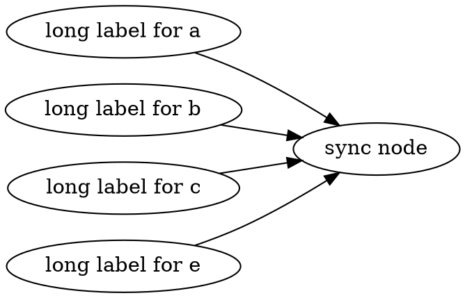

# API of @msagl/core

## Use the layout engine directly

When you interact with a renderer, many details are hidden under the hood.
Here we show how to call the engine, @msagl/core, directly.

### Create the graph, add geometry attributes to it, and call the default layout

First we need to say a few words on the classes involved: Node, Graph, and Edge.

Edge is the simplest of these three: it has the source and the target that are Nodes.
Node has three sets of Edges: outEdges, inEdges, and selfEdges.
If you have an object of Node available you can iterate over all edges adjacent to it.
For example, to process all edges having node 'n' as the source do the following:

```ts
for (const e of n.outEdges()) {
  // process edge 'e'
}
```

Graph extends Node, but in addition it has a NodeCollection, which is a wrapper
of Map<string, Node>: this way a Graph references its nodes. To create a sub-graph we add a Graph as a new node to the graph.

```ts
const graph = new Graph()
const subgraph = new Graph('a')
graph.addNode(subgraph)
```

This design seems minimal and efficient enough to maintain the graph structure. For example, to iterate over all edges of the graph
we go over the nodes in the graph's NodeCollection and iterate over outgoing and self-edge of the nodes.

The classes Graph, Node, and Edge extend class Entity. Entity has a field parent that is also an Entity.
This way a Node, and an Edge, have a reference to the Graph they belongs to.
Class Label facilitates labelled edges. The parent of a Label is the labeled edge.

Importantly, class Entity has an array of Attributes. The Attributes keep additional information associated with the graph entities.
There are geometry attributes, drawing attributes, and some others.
The geometry attributes are needed to create a layout. The drawing attributes are used during rendering.
By using attributes we avoid a duplication of the graph structure.

Now we show how to create a graph and lay it out with @msagl/core.

```ts
//First we create a Graph, the underlying structure to keep your graph.
const graph = new Graph()
// add some nodes and edges to the graph.
// add a node with id 'b'
const b = new Node('b')
graph.addNode(b)
// add a node with id 'c'
const c = new Node('c')
graph.addNode(c)
// create edges b->c, and d->a
const bc = new Edge(b, c)
new Edge(b, c)
```

The last statement of the code above

```ts
new Edge(b, c)
```

creates an instance of class Edge and adds it to b.outEdges and c.inEdges.
This way the edge is attached to the graph.
For the engine to run the layout, each node has to have node.boundaryCurve defined. In this examples we create circular nodes.

```ts
// create a geometry node gb
const gb = new GeomNode(b)
gb.boundaryCurve = CurveFactory.mkCircle(20, new Point(0, 0))
```

The two lines above create a GeomNode, gb, corresponding to node 'b',
which is actually an Attribute that is stored in the array of attributes of node 'b'.
The code also sets the boundary curve describing the shape of 'gb': in this case it is
a circle with the radius of length 20 and the center at the origin of the plane. The layout might transform the
curve later by changing the circle center. In general, the layout does not depend on the node.boundaryCurve initial positions. We create geometry attributes for each element of the graph
to interact with the layout, and, finally, call the layout engine. Below the whole working example.

```ts build
import {
  CurveFactory,
  Edge,
  GeomEdge,
  GeomGraph,
  GeomNode,
  Graph,
  Node,
  Point,
  layoutGeomGraph,
} from '@msagl/core'
const graph = new Graph()
// add some nodes and edges to the graph.
// add a node with id 'b'
const b = new Node('b')
graph.addNode(b)
// add a node with id 'c'
const c = new Node('c')
graph.addNode(c)
// create edges b->c, and d->a
const bc = new Edge(b, c)
const geomGraph = new GeomGraph(graph)
const gbc: GeomEdge = new GeomEdge(bc)
const gb = new GeomNode(b)
gb.boundaryCurve = CurveFactory.mkCircle(20, new Point(0, 0))
const gc = new GeomNode(c)
gc.boundaryCurve = CurveFactory.mkCircle(20, new Point(0, 0))
layoutGeomGraph(geomGraph)
console.log(gbc.curve)
```

This code produces the following output:  
'LineSegment {parStart: 0, parEnd: 1, start: Point { x*: 49.99999999999999, y*: 30},  
 end: Point { x*: 70, y*: 30 }}'  
In many cases we would like to control the engine more than in the previos example.
We describe three methods of the layout that are implemented in the package.

### Sugiyama scheme, or layered layout.

#### Short description of the method

Sugiayama scheme sometimes is also called the hierarchical layout. It is meant for a directed graph. It organizes the nodes in horizontal layers and renders the edges following their direction.
There is an [article](https://en.wikipedia.org/wiki/Layered_graph_drawing.) describing the method.  
The implementation of the scheme in MSAGL closely follows [the paper of Dot/Graphviz authors](https://www.researchgate.net/profile/Emden-Gansner/publication/3187542_A_Technique_for_Drawing_Directed_Graphs/links/5c0abd024585157ac1b04523/A-Technique-for-Drawing-Directed-Graphs.pdf). The differences of the implementation of MSAGL with the Dot approach are mostly described in [Drawing Graphs with GLEE](https://www.microsoft.com/en-us/research/wp-content/uploads/2016/02/gd2007-glee.pdf) and [Improving Layered Graph Layouts with Edge Bundling](https://elar.urfu.ru/bitstream/10995/111368/1/2-s2.0-79952265484.pdf). The improvements are in the fast calculation of the layers, and the edge routing.
##### Current limtitations
The constraint functionality for Sugiyama scheme is not implemented yet.

#### Calling Sugiama Scheme

There are two ways to ensure the Sugiyama Scheme. One way is to use the high level API:

```ts
function layoutGraphWithSugiayma(
  geomGraph: GeomGraph,
  cancelToken: CancelToken,
  transformToScreen: boolean,
)
```

The first parameter of the function is the graph under layout, the second is cancelToken to enable the method cancellation. The third argument, transformToScreen, when set to true will cause the geometry flip around the x-axis: transformation of the graph geometry by mapping (x,y) to (x, -y) and then shifting the graph into the first quadrand of the plane with the left-bottom of the graph at (0,0). The cancellation token is ignored by now, so null can be used for it.

Another method is to use property GeometryGraph.layoutSettings.

```ts
geomGraph.layoutSettings = new SugiyamaLayoutSettings()
// change the settings that you need
//try to move layers closer to each other
geomGraph.layoutSettings.yLayerSep /= 2
// change more settings here...
// call the layout engine
geomGraph.layoutSettings.layoutGraphWithSugiayma(geomGraph, null, false)
// or call
layoutGeomGraph(geomGraph) // and the setting will be respected
```

In general, SugiyamaLayoutSetting property corresponds to the attributes of [Dot language](https://graphviz.org/doc/info/lang.html).
The most popular settings to change in SugiyamaLayoutSettings is the layerDirection.

```ts
SugiamaLayoutSettings.layerDirection: LayerDirectionEnum
```

LayerDirectionEnum has values {TB, LR, BT, RL}, where TB means Top-Bottom, and is the default, LR means Left - Right, BT means Bottom - Top, and RL means Right - Left.
This enum comes from [Graphvis's rankdir](https://graphviz.org/docs/attrs/rankdir/). To avoid layouts which are too wide for a graph with long node labels the value LR is often used. If you use "Edit" button on the graph below and change 'rankdir' to TB then you will get a layout with a wide and low bounding box.



Function 'layoutGraphWithSugiayma()' does not require that geomGraph.layoutSettings is set, but if this property is undefined or
its type is not SugiamaLayoutSettings then a new SugiamaLayoutSettings() is created and assigned to the property. Function 'layoutGeomGraph()' also can change this property as we will describe later.

### Pivot Multidimensional Scaling, or Pivot MDS

#### The method background

MDS tries to place the graph on the two dimensional plane with the least distortion of the distances between the nodes. You can find more details on [Wikipedia](https://en.wikipedia.org/wiki/Multidimensional_scaling). The method disregards the directions of the edges. Pivot MDS, which is implemented in MSAGL, is a variant of MDS that uses only a subset of pivot nodes for the calculation, making it faster and suitable for large graphs. While MDS uses an n by n matrix for the distances between the nodes, where n is the number of nodes, Pivot MDS uses a k\*n matrix of the distances between each node and each of k pivot nodes. The implementation of Pivot MDS in the package follows [Eigensolver methods for progressive...](https://kops.uni-konstanz.de/bitstream/handle/123456789/5741/bp_empmdsld_06.pdf?sequence=1&isAllowed=y).

Pivot MDS ignores the node sizes and tends to create layouts where the nodes overlap each other. That is why it is followed by an overlap removal with the algorithm of [GTree](https://arxiv.org/pdf/1608.02653). Another additional step, because MDS does not route the edges, is edge routing which is described in [Fast edge-routing for large graphs](https://www.researchgate.net/profile/Tim-Dwyer-5/publication/43433413_Fast_Edge-Routing_for_Large_Graphs/links/0fcfd511cb774446dd000000/Fast-Edge-Routing-for-Large-Graphs.pdf).

#### Calling MDS

Calling

```ts
function layoutGraphWithMds(geomGraph: GeomGraph, cancelToken: CancelToken = null).
```

will create default 'MDSLayoutSettings' and calculate the layout.
If the graph has several thousands node then the default settings might cause a slow run.
Instead, create MDSLayoutSettings yourself and set IterationsWithMajorization to zero, to speed up.

```ts
const settings = new MdsLayoutSettings()
settings.IterationsWithMajorization() = 0
geomGraph.layoutSettings = settings
```

Each iteration with majorization step improves the node positions in a quadratic in the number of nodes time and can be sacrificed for the performance.

### IPSepCola

It is a variant of a force directed layout with approximate computation of long-range node-node repulsive forces to achieve O(n log n) running time per iteration,
where n is the number of node in a graph.
It can be invoked on an existing layout (for example, as computed by MDS) to beautify it.  
The method is described in [IPSepCola](https://www.researchgate.net/profile/Tim-Dwyer-5/publication/6715571_IPSep-CoLa_An_Incremental_Procedure_for_Separation_Constraint_Layout_of_Graphs/links/0fcfd5081c588735c8000000/IPSep-CoLa-An-Incremental-Procedure-for-Separation-Constraint-Layout-of-Graphs.pdf). In MSAGL IPSepCola starts by applying MDS and then improves on it.

#### Calling IPSepCola

```ts
const settings = new IPsepColaSetting()
/**
 * The third parameter of the method is the constraint level.
 * The value 2 of the constraint level means that the algorithm will try to satisfy most of the separation constraints, i.e. node separation.
 */
const runner = new IPSepCola(geomGraph, settings, 2)
runner.run()
```

### The default layout

When 'layoutGeomGraph()' is called for a GeomGraph with undefined layout settings then a layout is  
chosen by the following logic: If the graph is directed, and the number of nodes in the graph is not greater than 2000, and the number of edges in the graph is not greater than 4000,
then the Sugiyama Scheme is called. Otherwise, IPSepCola is called.

Graph is directed, for MSAGL, if it has at least one directed edge, and edge e is directed if e.sourceArrowhead or e.targetArrowhead is not null.

## Edge routing

There are following edge routing modes

```ts
export enum EdgeRoutingMode {
  Spline,

  SplineBundling,

  StraightLine,

  SugiyamaSplines,

  Rectilinear,

  None,
}
```

'SugiyamaSpline' is used only with the Sugiyama Scheme. The rest of the modes can be used with any layout. If the mode is None the edges are not routed.

### "Spline" routing mode

In this mode the edges are routed around the nodes. The method is rather fast, but unfortunately we do not have a
precize complexity measure. For a graph with 2K nodes+edges it can do the routing in less than a second or two. For a graph with 17k nodes+edges it might require half a minute.

The algorithm runs shortest paths on [a graph spanner](https://www.researchgate.net/profile/Tim-Dwyer-5/publication/43433413_Fast_Edge-Routing_for_Large_Graphs/links/0fcfd511cb774446dd000000/Fast-Edge-Routing-for-Large-Graphs.pdf) as the first step and then optimizes the paths by using [the funnel algorithm](https://www.sciencedirect.com/science/article/pii/002200008990041X/pdf?md5=aa398f6c4c6e17f6aa1688b7e5545cb9&pid=1-s2.0-002200008990041X-main.pdf). The implementation in MSAGLJS uses a new version of routing compared with
MSAGL.NET. This version is described [here](https://github.com/levnach/paper_msagljs/blob/main/main.pdf).
Here is an example of the routing:


### "SplineBundling" routing mode

This algorithm routes edges in the metroline style. The method is described in [“Edge routing with ordered bundles”](https://arxiv.org/pdf/1209.4227.pdf). The algorithm is not very efficient and is slower than the spline routing.
In the drawing below the layout is the same but the edges are routed with the SplineBundling algorithm.


### "Rectilinear" routing mode

The method routes edges with segments parallel to the coordinate axes, with an optional arcs at the corners. The mode is not fast, slower than "SplineBundling", and might slow down considerably even on a graph with 90 nodes.


### "StraightLine" routing mode

It is the fastest mode that routes each edge as a straight line clipped at the source and the target. This mode is a good fallback for a very large graph.

## Renderer with Deck.gl

Constructor:

```ts
new Renderer(container?: HTMLDivElement)
```

To layout and render a new graph:

```ts
renderer.setGraph(g: Graph, options: RenderOptions)
```

To change the layout of the current graph:

```ts
renderer.setOptions(options: LayoutOptions)
```

## Usage of SVG Renderer

```ts build
import { parseDot } from '@msagl/parser'
import { RendererSvg } from '@msagl/renderer-svg'
const renderer = new RendererSvg()
const graph = parseDot(`
graph G {
	kspacey -- swilliams;
	swilliams -- kbacon;
	bpitt -- kbacon;
	hford -- lwilson;
	lwilson -- kbacon;
}`)
renderer.setGraph(graph)
```

## Renderer with SVG API

Constructor:

```ts
rendererSvg=new RendererSVG(container?: HTMLDivElement)
```

To layout and render a new graph:

```ts
rendererSvg.setGraph(g: Graph, options: RenderOptions)
```

To change the layout of the current graph:

```ts
rendererSvg.setOptions(options: LayoutOptions)
```

To get the SVG representation of the graph:

```ts
getSvg(): SVGAElement
```
