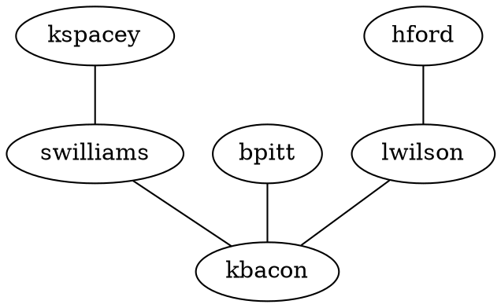

# Getting Started

## Installation

Using NPM packages:

```bash npm2yarn
npm install msagl-js @msagl/parser @msagl/renderer
```

```js
import {Graph} from 'msagl-js'
import {Renderer} from '@msagl/renderer'
```

Using script tags:

```html
<script src="https://unpkg.com/msagl-js@latest/dist.min.js"></script>
<script src="https://unpkg.com/@msagl/parser@latest/dist.min.js"></script>
<script src="https://unpkg.com/@msagl/renderer@latest/dist.min.js"></script>
```

```js
const {Graph, Renderer} = msagl
```

## Usage of Deck.gl renderer

Render a graph from a [DOT](<https://en.wikipedia.org/wiki/DOT_(graph_description_language)#:~:text=DOT%20is%20a%20graph%20description,programs%20can%20process%20DOT%20files.>) file:



This code can be run in the browser.

```js title="./script.js"
import {parseDot} from '@msagl/parser'
import {Renderer} from '@msagl/renderer'

const renderer = new Renderer()
const graph = parseDot(`
graph G {
	kspacey -- swilliams;
	swilliams -- kbacon;
	bpitt -- kbacon;
	hford -- lwilson;
	lwilson -- kbacon;
}`)
renderer.setGraph(graph)
```

Render a graph from JSON:

```js
import {parseJSON} from '@msagl/parser'

const graph = parseJSON({
  nodes: [{id: 'kspacey'}, {id: 'swilliams'}, {id: 'kbacon'}, {id: 'bpitt'}, {id: 'hford'}, {id: 'lwilson'}],
  edges: [
    {source: 'kspacey', target: 'swilliams'},
    {source: 'swilliams', target: 'kbacon'},
    {source: 'bpitt', target: 'kbacon'},
    {source: 'hford', target: 'lwilson'},
    {source: 'lwilson', target: 'kbacon'},
  ],
})
renderer.setGraph(graph)
```
