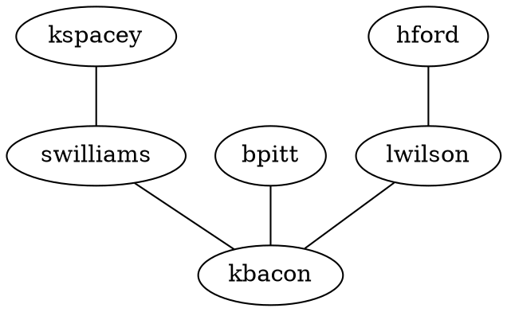

# Getting Started

MSAGLJS usage primarily falls into three categories: interacting with the core layout engine, the SVG renderer, or the Deck.gl renderer.
* If you are only interested in getting the layout of a graph, you can use the core layout engine, that is `@msagl/core` package.
* If your intention is to render, and possibly edit, a graph in an Internet browser, you can use the SVG renderer, that is in the `@msagl/renderer-svg` package.
* The third option, the Deck.gl renderer, from the `@msagl/renderer-webgl` package, is where you explore a larger graph in an Internet browser. The renderer uses the visualization style similar to online maps.

## Installation

If you use only the core layout engine, you can install just the `@msagl/core` package:

```bash npm2yarn
npm install @msagl/core
```

If you use the SVG renderer, you need to install @msagl/renderer-svg:

```bash npm2yarn
npm install @msagl/renderer-svg.
```

If you use the Deck.gl renderer, you need to install @msagl/renderer-webgl:

```bash npm2yarn
npm install @msagl/renderer-webgl
```
## Build
We recommend building MSAGLJS under linux, or under Windows WSL.
```bash npm2yarn
npm run build
```
builds MSAGLJS locally when ran in the root of the repository.
## Running the examples
To run the examples locally, with your local changes, follow this pattern:
```
cd examples/webgl-renderer
yarn start
```   
You should see output similar to the one below:
```
> Local:   http://127.0.0.1:8001/
> Network: http://172.31.24.74:8001
```
Follow (ctrl+click), or copy paste one of these link addresses in a browser to run the example.
## Usage of renderers
  
### Create a graph and pass it to the renderer

Here is a fragment from the [example](https://microsoft.github.io/msagljs/renderer-svg-no-parser/index.html),
where a Graph object, together with two nodes and an edge, is created from scratch.
You can read about involved types in [API of @msagl/core](./api.md). 
``` ts build
import {RendererSvg} from '@msagl/renderer-svg'
import {Node, Graph, Edge} from '@msagl/core'

const viewer = document.getElementById('viewer')
const svgRenderer = new RendererSvg(viewer)
svgRenderer.layoutEditingEnabled = false

const graph = createGraph()
svgRenderer.setGraph(graph)

function createGraph(): Graph {
  //First we create a Graph object
  const graph = new Graph()
  // add some nodes and edges to the graph.
  // add a node with id 'b'
  const b = new Node('b')
  graph.addNode(b)
  // add a node with id 'c'
  const c = new Node('c')
  graph.addNode(c)
  // create edge from b to c
  const bc = new Edge(b, c)
  new Edge(b, c)
  return graph
}
```

### Create a Graph object from a file
#### From DOT 
A graph can be created from a string in [DOT format](<https://en.wikipedia.org/wiki/DOT_(graph_description_language)#:~:text=DOT%20is%20a%20graph%20description,programs%20can%20process%20DOT%20files.>), by using function ``parseDot()`` in package '@msagl/parser'.
The function uses [Andrei Kascha's dotparser](https://github.com/anvaka/dotparser). 
Below is a *live* example: Pressing the "Edit" button brings a pane with the graph DOT string and a "Run" button. The string can be edited and 
the graph is reloaded on a "Run" button click.



Here is some of the behind the scene code.

```ts build
import { parseDot } from '@msagl/parser'
import { RendererSvg } from '@msagl/renderer-svg'
import { Graph } from '@msagl/core'
// create the SVG renderer
const renderer = new RendererSvg()
// parse a small graph
const graph: Graph = parseDot(`
graph G {
	kspacey -- swilliams;
	swilliams -- kbacon;
	bpitt -- kbacon;
	hford -- lwilson;
	lwilson -- kbacon;
}`)
// calculate the layout and render
renderer.setGraph(graph)
```
#### From JSON
Here we render a graph parsed from a JSON string with the DeckGL renderer

```ts build
import { parseJSON } from '@msagl/parser'
import { Renderer } from '@msagl/renderer-webgl'
import { Graph } from '@msagl/core'
//create a renderer
const renderer = new Renderer()
// parse a graph
const graph: Graph = parseJSON({
  nodes: [
    { id: 'kspacey' },
    { id: 'swilliams' },
    { id: 'kbacon' },
    { id: 'bpitt' },
    { id: 'hford' },
    { id: 'lwilson' },
  ],
  edges: [
    { source: 'kspacey', target: 'swilliams' },
    { source: 'swilliams', target: 'kbacon' },
    { source: 'bpitt', target: 'kbacon' },
    { source: 'hford', target: 'lwilson' },
    { source: 'lwilson', target: 'kbacon' },
  ],
})
// attach the graph to the renderer: this causes the layout engine to run and the graph to be rendered
renderer.setGraph(graph)
```
Function ``function parseJSON(json: JSONGraph | SimpleJSONGraph): Graph`` can accept an object of [SimpleJSONGraph ](https://github.com/microsoft/msagljs/blob/e36c5693cd07f2a6e28d8775c7afbb54226c2022/modules/parser/src/dotparser.ts#L1224) type, or as [Graph of dotparser](https://github.com/anvaka/dotparser/blob/934be0396f4e89f9554c52e088ff5a4ae3e5fe94/index.d.ts#L53).
#### From ".txt", "tsv", or ".csv"
Function 'parseTXT()' from @msagl/parser will try to parse a file with extention '.txt', '.tsv',
or '.csv'. Each line of the file defines an edge and expected to follow pattern "sourceId targetId".
The blank between sourceId and targetId can be replaced by a comma, or a tab character.

 