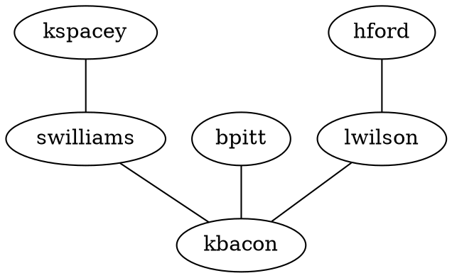

# Getting Started

There are three main scenarios for using MSAGL:
using the core layout engine, using the SVG renderer, and using the Deck.gl renderer.
If you are only interested in getting the layout of a graph, you can use the core layout engine, that is `@msagl/core` package.
If you want to render, and possibly edit, a graph in an Internet browser, you can use the SVG renderer, that is in the `@msagl/renderer-svg` package.
The third option, the Deck.gl renderer, from the `@msagl/renderer-webgl` package, is for a scenario where you explore a larger graph. DeckGL renderer uses
the visualization style similar to online maps.

## Installation

If you use only the core layout engine, you can install just the `@msagl/core` package:

```bash npm2yarn
npm install @msagl/core
```

If you use the SVG renderer, you need to install @msagl/renderer-svg:

```bash npm2yarn
npm install @msagl/renderer-svg.
```

If you use the Deck.gl renderer, you need to install @msagl/renderer-webgl:

```bash npm2yarn
npm install @msagl/renderer-webgl
```

## Usage of renderers

The renderers can accept a graph in a [DOT](<https://en.wikipedia.org/wiki/DOT_(graph_description_language)#:~:text=DOT%20is%20a%20graph%20description,programs%20can%20process%20DOT%20files.>) format:



This code can be run in an Internet browser.

```ts build
import { parseDot } from '@msagl/parser'
import { RendererSvg } from '@msagl/renderer-svg'

const renderer = new RendererSvg()
const graph = parseDot(`
graph G {
	kspacey -- swilliams;
	swilliams -- kbacon;
	bpitt -- kbacon;
	hford -- lwilson;
	lwilson -- kbacon;
}`)
renderer.setGraph(graph)
```

Render a graph from JSON:

```ts build
import { parseJSON } from '@msagl/parser'
import { Renderer } from '@msagl/renderer-svg'

const renderer = new RendererSvg()
const graph = parseJSON({
  nodes: [
    { id: 'kspacey' },
    { id: 'swilliams' },
    { id: 'kbacon' },
    { id: 'bpitt' },
    { id: 'hford' },
    { id: 'lwilson' },
  ],
  edges: [
    { source: 'kspacey', target: 'swilliams' },
    { source: 'swilliams', target: 'kbacon' },
    { source: 'bpitt', target: 'kbacon' },
    { source: 'hford', target: 'lwilson' },
    { source: 'lwilson', target: 'kbacon' },
  ],
})
renderer.setGraph(graph)
```
