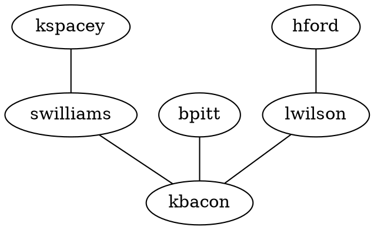

# Getting Started

There are three main scenarios for using MSAGL. You can interact with the core layout engine, or the SVG renderer, or the Deck.gl renderer.
* If you are only interested in getting the layout of a graph, you can use the core layout engine, that is `@msagl/core` package.
* If your intention is to render, and possibly edit, a graph in an Internet browser, you can use the SVG renderer, that is in the `@msagl/renderer-svg` package.
* The third option, the Deck.gl renderer, from the `@msagl/renderer-webgl` package, is where you explore a larger graph in an Internet browser. The renderer uses the visualization style similar to online maps.

## Installation

If you use only the core layout engine, you can install just the `@msagl/core` package:

```bash npm2yarn
npm install @msagl/core
```

If you use the SVG renderer, you need to install @msagl/renderer-svg:

```bash npm2yarn
npm install @msagl/renderer-svg.
```

If you use the Deck.gl renderer, you need to install @msagl/renderer-webgl:

```bash npm2yarn
npm install @msagl/renderer-webgl
```

## Usage of renderers

The renderers can accept a graph in a [DOT](<https://en.wikipedia.org/wiki/DOT_(graph_description_language)#:~:text=DOT%20is%20a%20graph%20description,programs%20can%20process%20DOT%20files.>) format.
Pressing the "Edit" button below brings a pane where the graph can be edited and rendered.



Below is an example of the minimal TypeScript code to render a graph with the SVG renderer.

```ts build
import { parseDot } from '@msagl/parser'
import { RendererSvg } from '@msagl/renderer-svg'
import { Graph } from '@msagl/core'
// create the SVG renderer
const renderer = new RendererSvg()
// parse a small graph
const graph: Graph = parseDot(`
graph G {
	kspacey -- swilliams;
	swilliams -- kbacon;
	bpitt -- kbacon;
	hford -- lwilson;
	lwilson -- kbacon;
}`)
// calculate the layout and render
renderer.setGraph(graph)
```

Here we render a graph, parsed from a JSON string, with the DeckGL renderer

```ts build
import { parseJSON } from '@msagl/parser'
import { Renderer } from '@msagl/renderer-webgl'
import { Graph } from '@msagl/core'
//create a renderer
const renderer = new Renderer()
// parse a graph
const graph: Graph = parseJSON({
  nodes: [
    { id: 'kspacey' },
    { id: 'swilliams' },
    { id: 'kbacon' },
    { id: 'bpitt' },
    { id: 'hford' },
    { id: 'lwilson' },
  ],
  edges: [
    { source: 'kspacey', target: 'swilliams' },
    { source: 'swilliams', target: 'kbacon' },
    { source: 'bpitt', target: 'kbacon' },
    { source: 'hford', target: 'lwilson' },
    { source: 'lwilson', target: 'kbacon' },
  ],
})
// attach the graph to the renderer: this causes the layout engine to run and the graph to be rendered
renderer.setGraph(graph)
```

Function 'parseTXT()' from @msagl/parser will try to parse a file with extention '.txt', '.tsv',
or '.csv'. Each line of the file defines an edge and expected to follow a pattern "sourceId\ttargetId",
"sourceId targetId", or "sourceId,targetId".
That is two words, indicating the IDs of the edge source and the edge target,
separated by a tabulation symbol, by a space, or by a comma. Each line defines an edge.
A directed graph will be generated.
