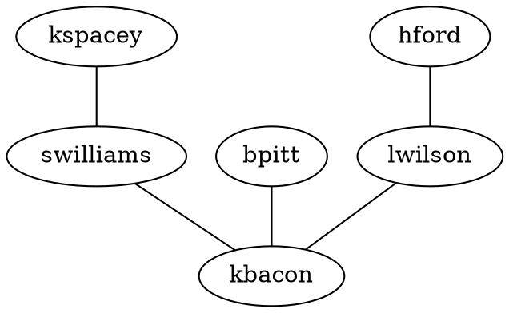

# MSAGL

`msagl-js` is a JavaScript implementation of advanced graph layout algorithms. It is a port of .NET layout engine [MSAGL](https://github.com/microsoft/automatic-graph-layout). `msagl-js` is currently under development and it comprises the following modules:

- `msagl-js`: the core graph data structures and layout engine
- `@msagl/parser`: convert common formats to MSAGL Graph instances
- `@msagl/renderer`: a WebGL-powered rendering component

## The latest

The current version improves the handling of large graphs in two aspects.
Firstly, loading is faster than before: a [graph](https://github.com/microsoft/msagljs/blob/main/examples/data/composers.json) with 3405 nodes and 13832 edges was loaded on a Lenovo Legion 7 laptop in half a minute.
Secondly, and suprisingly, the edge quality has been improved. The edges in MSAGL are usually routed as splines avoiding the nodes. Now the edge routes in many cases are optimal.

To browse a large graph please use [the Web-GL example](https://microsoft.github.io/msagljs/deck.gl_backend/index.html),
and for browsing and editing smaller graphs use [the SVG example](https://microsoft.github.io/msagljs/svg_backend/index.html)

## Installation

Using NPM packages:

```bash npm2yarn
npm install msagl-js @msagl/parser @msagl/renderer
```

```js
import {Graph} from 'msagl-js'
import {Renderer} from '@msagl/renderer'
```

Using script tags:

```html
<script src="https://unpkg.com/msagl-js@latest/dist.min.js"></script>
<script src="https://unpkg.com/@msagl/parser@latest/dist.min.js"></script>
<script src="https://unpkg.com/@msagl/renderer@latest/dist.min.js"></script>
```

```js
const {Graph, Renderer} = msagl
```

## Usage of Deck.gl renderer

Render a graph from a [DOT](<https://en.wikipedia.org/wiki/DOT_(graph_description_language)#:~:text=DOT%20is%20a%20graph%20description,programs%20can%20process%20DOT%20files.>) file:



```js
import {parseDot} from '@msagl/parser'
import {Renderer} from '@msagl/renderer'

const renderer = new Renderer()
const graph = parseDot(`
graph G {
	kspacey -- swilliams;
	swilliams -- kbacon;
	bpitt -- kbacon;
	hford -- lwilson;
	lwilson -- kbacon;
}`)
renderer.setGraph(graph)
```

Render a graph from JSON:

```js
import {parseJSON} from '@msagl/parser'

const graph = parseJSON({
  nodes: [{id: 'kspacey'}, {id: 'swilliams'}, {id: 'kbacon'}, {id: 'bpitt'}, {id: 'hford'}, {id: 'lwilson'}],
  edges: [
    {source: 'kspacey', target: 'swilliams'},
    {source: 'swilliams', target: 'kbacon'},
    {source: 'bpitt', target: 'kbacon'},
    {source: 'hford', target: 'lwilson'},
    {source: 'lwilson', target: 'kbacon'},
  ],
})
renderer.setGraph(graph)
```

## Renderer with Deck.gl API

Constructor:

```typescript
new Renderer(container?: HTMLDivElement)
```

To layout and render a new graph:

```typescript
renderer.setGraph(g: Graph, options: RenderOptions)
```

To change the layout of the current graph:

```typescript
renderer.setOptions(options: LayoutOptions)
```

## Usage of SVG Renderer

```typescript
import {parseDot} from '@msagl/parser'
import {RendererSvg} from '@msagl/renderer'

const renderer = new RendererSvg()
const graph = parseDot(`
graph G {
	kspacey -- swilliams;
	swilliams -- kbacon;
	bpitt -- kbacon;
	hford -- lwilson;
	lwilson -- kbacon;
}`)
```

## Renderer with SVG API

Constructor:

```typescript
rendererSvg=new RendererSVG(container?: HTMLDivElement)
```

To layout and render a new graph:

```typescript
rendererSvg.setGraph(g: Graph, options: RenderOptions)
```

To change the layout of the current graph:

```typescript
rendererSvg.setOptions(options: LayoutOptions)
```

To get the SVG representation of the graph:

```typescript
getSvg(): SVGAElement
```

The renderer options accept the following fields:

- `layoutType: 'Sugiyama LR' | 'Sugiyama TB' | 'Sugiyama BT' | 'Sugiyama RL' | 'IPSepCola' | 'MDS'` - algorithm used to layout the graph.
  By default, if all the edges in the graph are undirected, IPSepCola algorithm is used; otherwise, the graph is laid out with the Sugiyama Scheme.

  [Sugiyama](https://en.wikipedia.org/wiki/Layered_graph_drawing) TB :layered top-to-bottom.

  
  

  [IPSepCola](https://www.researchgate.net/profile/Tim-Dwyer-5/publication/6715571_IPSep-CoLa_An_Incremental_Procedure_for_Separation_Constraint_Layout_of_Graphs/links/0fcfd5081c588735c8000000/IPSep-CoLa-An-Incremental-Procedure-for-Separation-Constraint-Layout-of-Graphs.pdf) An Incremental Procedure for Separation Constraint Layout of Graphs:
  
  

  [MDS](https://pubsys.mmsp-kn.de/pubsys/publishedFiles/BrPi06.pdf): Pivot Multidemensional Scaling:


```

- `label`
  - `fontFamily: string` - CSS font-family value. Default `'sans-serif'`.
  - `fontSize: number` - Font size, default `16`.
  - `lineHeight: number` - Line height relative to the font size, default `1`.
  - `fontStyle: string` - CSS font-style value, default `'normal'`
  - `fontWeight: string | number` - CSS font-weight value, default `'normal'`.
- `edgeRoutingMode: EdgeRoutingMode` - Enum for supported routing modes, including `Spline`, `SplineBundling` `StraightLine`, `SugiyamaSplines`, `Rectilinear`, `RectilinearToCenter`, `None`. Default varies by `layoutType`.

## Layout Editing

There are some layout editing capabilities that are demonstrated by the video below:


[](https://youtu.be/j-zsysohSU0)
They include:

- dragging of the entities; one can select and drag a group of entities as well
- deletion of the entities
- node insertion
- edge insertion
- editing the node label
- edge curve editing
- undo/redo

  The current limitations are:

- the edge routing switches to straight lines when dragging
- undo/redo does not work for node label text editing
- the node does not resize for the new label text
- only [the viewer with SVG](https://microsoft.github.io/msagljs/svg_backend/index.html) supports editing.
```
